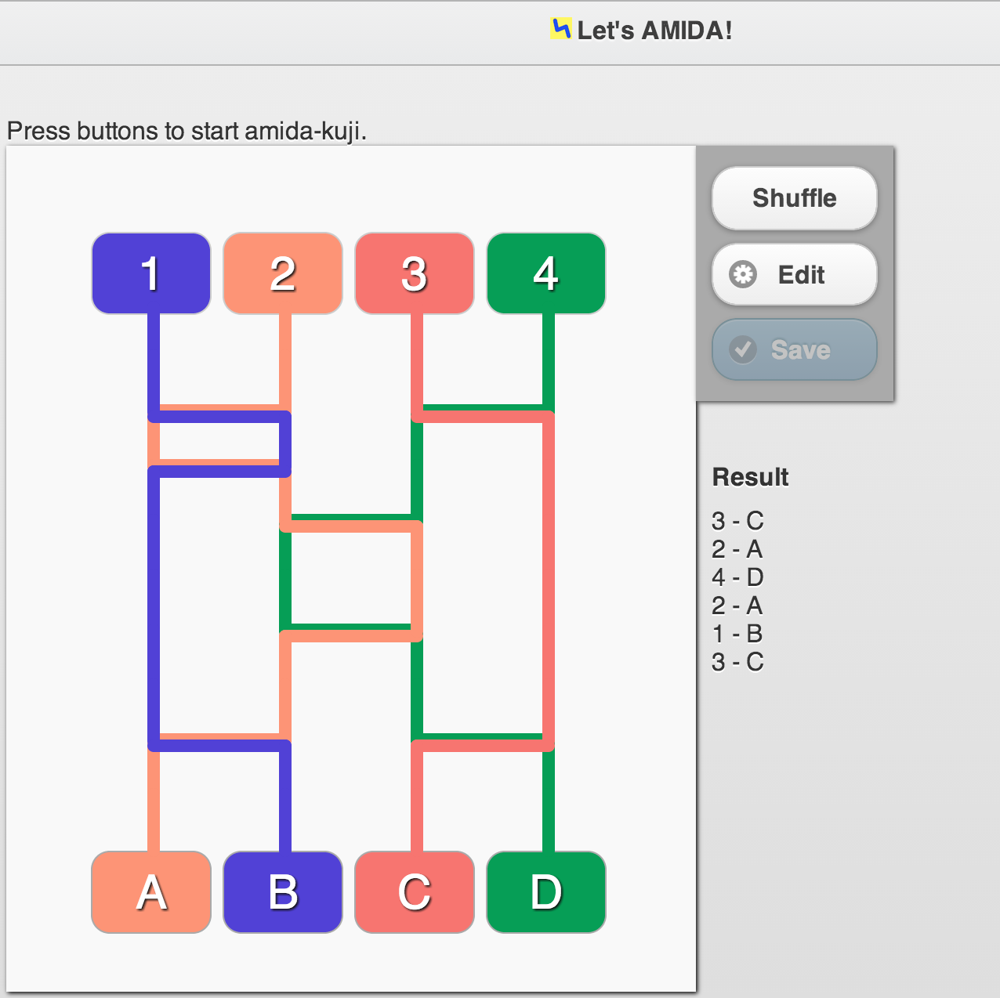

AMIDA
=====

An Amida-Kuji (aka ghost leg) game written in JavaScript.

[AMIDA]: http://okunishinishi.github.io/AMIDA/

## [Play it now!][AMIDA]

[][AMIDA]

Donation
-------

[gittip-okunishinishi]: https://www.gittip.com/okunishinishi/

Support this project and [others by okunishinishi][gittip-okunishinishi] via [gittip][gittip-okunishinishi].

[][gittip-okunishinishi]

License
-------
This software is released under the [MIT License](https://raw.github.com/okunishinishi/AMIDALICENSE/master/LICENSE).
